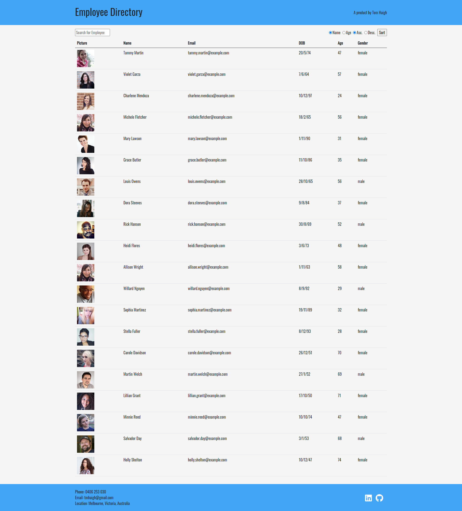

# Employee Directory

   

## Description

A fully responsive React.js web product that generates 20 random users and allows the client to search for a user by name or sort the list of users by age or name in ascending or descending order. This is a boilerplate product that can be easily transformed to incorporate employees from a place of business. This is handy tool to be used by employers in order to keep track of employee details and to retrieve the employee information easily if needed.

## Technologies

- HTML
- CSS
- JavaScript
- React
- Bootstrap
- Node.js
- Express.js
- MongoDB
- Mongoose

## Deployed Link

https://employee-directory-5000.herokuapp.com/

## Screenshot

## Contact

Got any questions? Please contact me at tmhaigh@gmail.com 
View my online portfolio https://conanas.github.io/ 
View my LinkedIn https://www.linkedin.com/in/thomas-m-haigh/